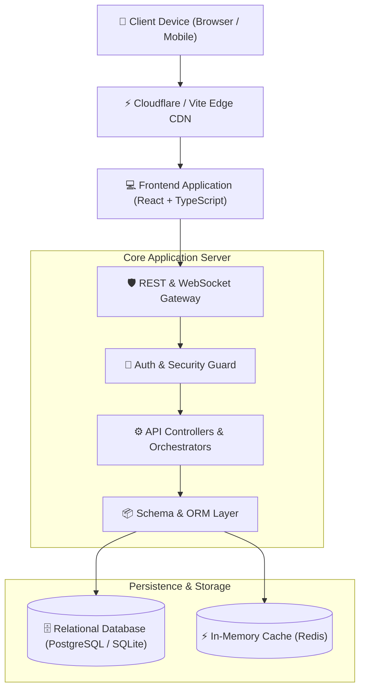

<div align="center">

# 🌟 CareSync

### *Coordinated outpatient care, simplified.*

CareSync is a unified digital health platform that helps outpatient practices coordinate appointments, secure patient communication, and clinical records in one workflow-driven system.

<br />

[](https://opensource.org/licenses/MIT) [](https://www.typescriptlang.org/) [](https://react.dev/) [](https://nodejs.org/) [](http://makeapullrequest.com) [](https://github.com/MohaMedTArEk912/CareSync)

<br />

[Explore Features](#-key-features) • [Architecture](#-system-architecture) • [API Reference](#-rest-api-reference) • [Getting Started](#-getting-started) • [Contributing](#-contributing)

</div>

---

## 📑 Table of Contents
1. [💡 Problem & Solution](#-problem--solution)
2. [✨ Key Features](#-key-features)
3. [🏗️ System Architecture](#-system-architecture)
4. [🗄️ Database Models](#-database-models)
5. [🔌 REST API Reference](#-rest-api-reference)
6. [🛠️ Tech Stack](#-tech-stack)
7. [🚀 Getting Started](#-getting-started)
8. [📁 Project Directory Structure](#-project-directory-structure)
9. [🤝 Contributing](#-contributing)
10. [📄 License](#-license)

---

## 💡 Problem & Solution

### ⚠️ The Problem
Modern workflows are often bogged down by fragmented systems, legacy manual steps, and lack of real-time synchronization, resulting in administrative overload and miscommunication.

**Key Pain Points Addressed:**
- ❌ Fragmented and disjointed legacy workflows
- ❌ Manual, error-prone data entry and synchronization
- ❌ Slow response times and lack of real-time collaboration

### 🎯 The Solution
CareSync provides a unified, end-to-end modern architecture engineered to streamline operations, reduce cognitive load, and automate complex pipelines seamlessly.

> **Core Value Proposition**:  
> *Delivering maximum efficiency with state-of-the-art developer experience and intuitive user workflows.*

---

## ✨ Key Features

- ⚡ **Real-time Synchronization**: Instant data delivery and state management
- ⚡ **Role-Based Access Control**: Granular permission tiers and secure sessions
- ⚡ **Autonomous Workflows**: End-to-end task execution and AI telemetry
- 🎨 **Modern Liquid Glass UI**: Responsive, accessible, and high-performance design system
- 📊 **Real-time Telemetry**: Live progress tracking and autonomous pipeline status reporting
- 🔒 **Enterprise-Grade Security**: Industry-standard authentication, authorization, and audit logs

---

## 🏗️ System Architecture



---

## 🗄️ Database Models

| Entity Model | Key Fields | Relations | Description |
| :--- | :--- | :--- | :--- |
| **User** | `id`, `email`, `role`, `createdAt` | Projects, Teams | Primary user account & identity |
| **Project** | `id`, `name`, `ownerId`, `status` | User, Documents | Core workspace container |
| **ActivityLog** | `id`, `action`, `timestamp`, `userId` | User | System audit trail & telemetry |


---

## 🔌 REST API Reference

| Method | Endpoint | Description | Auth Required |
| :---: | :--- | :--- | :---: |
| `POST` | `/api/v1/auth/register` | Register User Account for User | 🔒 Bearer Token |
| `GET` | `/api/v1/patients/profile` | Get Patient Medical Profile for PatientProfile | 🔒 Bearer Token |
| `POST` | `/api/v1/care-plans` | Create Patient Care Plan for CarePlan | 🔒 Bearer Token |
| `GET` | `/api/v1/care-plans` | List Active Care Plans for CarePlan | 🔒 Bearer Token |
| `POST` | `/api/v1/appointments` | Schedule Care Appointment for Appointment | 🔒 Bearer Token |
| `GET` | `/api/v1/appointments` | List Upcoming Appointments for Appointment | 🔒 Bearer Token |
| `POST` | `/api/v1/health-metrics` | Log Patient Health Metric for HealthMetric | 🔒 Bearer Token |
| `GET` | `/api/v1/health-metrics` | Get Patient Vital Records for HealthMetric | 🔒 Bearer Token |
| `GET` | `/api/v1/users` | Retrieve paginated list of User records | 🔒 Bearer Token |
| `GET` | `/api/v1/patientprofiles` | Retrieve paginated list of PatientProfile records | 🔒 Bearer Token |


### Example cURL Request
```bash
curl -X GET "https://api.github.com/MohaMedTArEk912/CareSync" \
  -H "Accept: application/vnd.github.v3+json"
```

---

## 🛠️ Tech Stack

| Domain | Technologies |
| :--- | :--- |
| **Frontend** | React 18, TypeScript, Tailwind CSS, Lucide Icons, Vite |
| **Backend** | Node.js, Express.js, TypeScript |
| **Database & ORM** | PostgreSQL / SQLite, Prisma ORM |
| **Architecture Engine** | Akasha AI Autonomous Architecture Platform |
| **DevOps & Tooling** | Git, Docker, ESLint, Prettier |

---

## 🚀 Getting Started

Follow these steps to get a local development environment up and running.

### 📋 Prerequisites
- **Node.js**: `>= 18.0.0`
- **npm** or **pnpm**: `>= 9.0.0`
- **Git**: Installed and configured

### 💻 Installation

1. **Clone the Repository**
   ```bash
   git clone https://github.com/MohaMedTArEk912/CareSync.git
   cd CareSync
   ```

2. **Install Dependencies**
   ```bash
   npm install
   ```

3. **Configure Environment Variables**
   Create a `.env` file in the root directory:
   ```env
   PORT=5000
   NODE_ENV=development
   DATABASE_URL="file:./dev.db"
   JWT_SECRET="your-super-secret-jwt-key"
   CLIENT_URL="http://localhost:5173"
   ```

4. **Launch the Development Server**
   ```bash
   npm run dev
   ```
   Open your browser and navigate to `http://localhost:5173`.

---

## 📁 Project Directory Structure

```ascii
CareSync/
├── client/                 # Frontend client application
│   ├── src/
│   │   ├── components/     # UI primitives & design system components
│   │   ├── pages/          # Primary application views & route handlers
│   │   ├── hooks/          # React hooks & store bindings
│   │   └── types/          # TypeScript domain interfaces
│   └── package.json
├── server/                 # Backend REST & WebSocket server
│   ├── src/
│   │   ├── controllers/    # Route controllers & business logic
│   │   ├── routes/         # Express endpoint definitions
│   │   └── lib/            # Database clients & helper utilities
│   └── package.json
├── .env.example            # Environment configuration template
└── README.md               # Project documentation
```

---

## 🤝 Contributing

Contributions, issues, and feature requests are welcome!

1. **Fork the Project**
2. **Create your Feature Branch** (`git checkout -b feature/AmazingFeature`)
3. **Commit your Changes** (`git commit -m 'feat: add AmazingFeature'`)
4. **Push to the Branch** (`git push origin feature/AmazingFeature`)
5. **Open a Pull Request**

---

## 📄 License

Distributed under the **MIT License**. See [`LICENSE`](LICENSE) for more information.

<div align="center">
  <sub>Engineered with precision using <a href="https://github.com/MohaMedTArEk912/CareSync">Akasha AI</a>.</sub>
</div>
